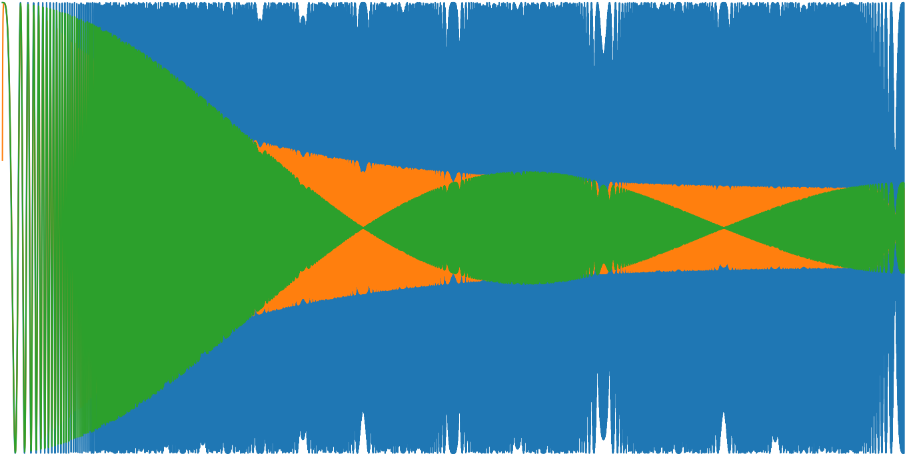
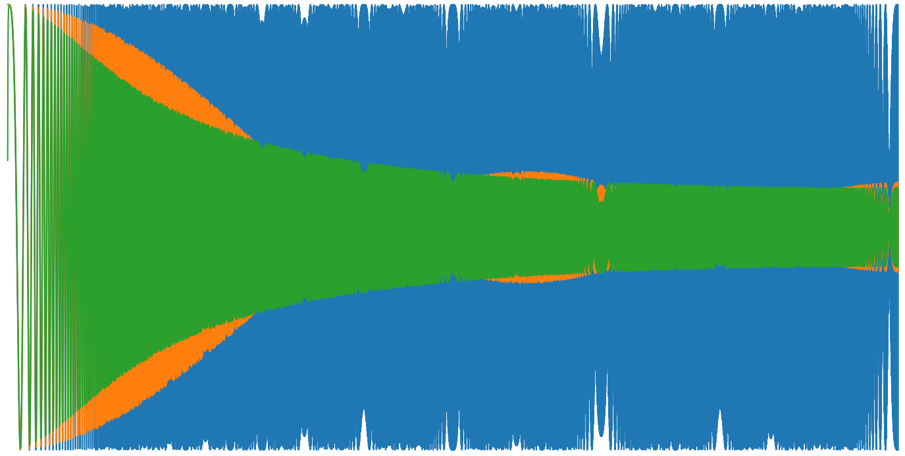
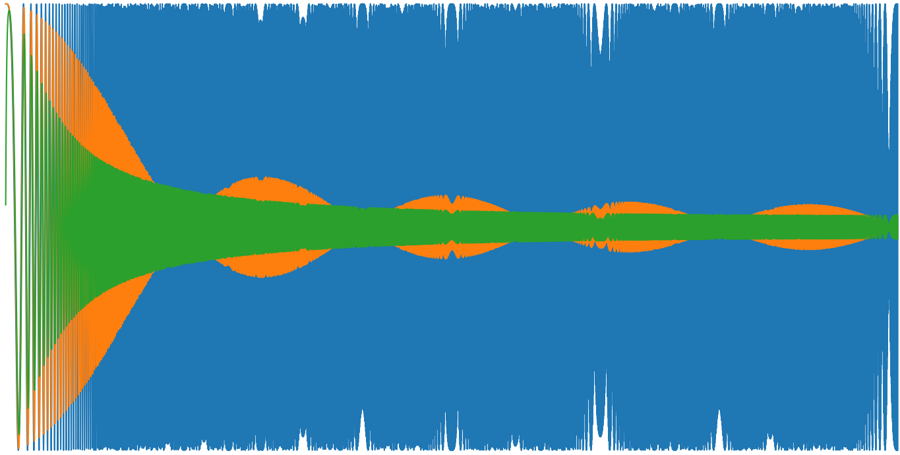

# Digital Filter Comparison

I find myself writing simple "smoothing" digital filters a lot. The go-to choice is a standard moving window average. But then there's all that buffer management, initialisation, and looping. My fingers do get tired from all that typing. On the other hand a single pole IIR filter (`y[i] = a*x[i] + b*y[i-1]`) is about two lines of code, in any language, and you only need to store a single variable with no indexing, bugger all initialisation and no buffer management. So it's been nagging in the back of my mind: just how bad is a single pole IIR compared to a moving window average?

Behold, the answer awaits.

See below for frequency response of the two filters when applied to a chirp from DC to the Nyquist frequency. If you were to assign units for the x-axis, you could say the chirp is from 0Hz to 500Hz, spread linearly over 10s, sampled every 1ms. The takeaways for me are:

* It's not hard to find a window size for the moving average filter, and a decay parameter for the IIR filter, that result in similar low pass frequency response.
* The moving average has a perculiar trait where the response goes to zero periodically. The frequencies correspond to multiples of a full window buffer.
* The IIR filter has a more traditional low pass roll off.
* The filters perform differently, but not different enough to warrant all that typing! Indeed, the IIR filter has a predictable monotonic roll-off, so I'm now relegating the moving window average to the "filters I used to know" pile.

